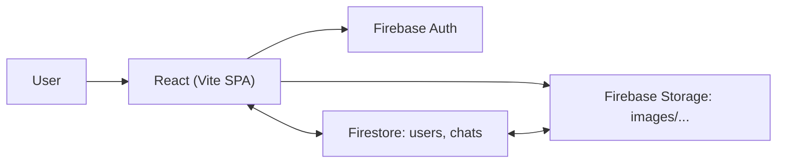

# Real-Time Chat Application 💬

## **Overview**

A production-style chat application built with **React + Vite** and **Firebase** (**Authentication**, **Firestore**, **Storage**). It delivers secure email/password sign-in, profile management (avatar, name, bio), real-time conversations, and image sharing—wrapped in a responsive SPA.

## 🔗 **Live Demo**

[](https://full-stack-real-time-chat-web-application.vercel.app)

## 👀 **Quick Preview**

<p align="center">
  <a href="https://full-stack-real-time-chat-web-application.vercel.app">
    
  </a>
</p>

---

## **Key Features**

* **Secure Auth** — Email/password via Firebase Authentication; protected routes with React Router.
* **Profiles** — User profile with avatar, display name, bio, and last-seen status.
* **Real-Time Chat List** — Live chat threads powered by Firestore listeners; sorted by recent activity.
* **Image Sharing** — Upload images to Firebase Storage; messages include image URLs for instant rendering.
* **Responsive UI** — Left/Right sidebars and a focused ChatBox for a smooth desktop/mobile experience.
* **Clean Architecture** — Context API for global session state; clear separation of pages, components, and lib helpers.

---

## **Technology Stack**

* **Frontend:** React, Vite, CSS
* **Routing:** React Router
* **State:** React Context API (`AppContext`)
* **Cloud:** Firebase (Auth, Firestore, Storage)
* **Deployment:** Vercel (SPA), Firebase Hosting config included

---

## **Architecture (High Level)**



---

## **Data Model**

### `users/{uid}`

Stores profile & presence:

```json
{
  "id": "<uid>",
  "username": "<lowercase>",
  "email": "<email>",
  "name": "",
  "avatar": "",
  "bio": "Hey, There i am using chat app",
  "lastSeen": <epoch_ms>
}
```

### `chats/{uid}`

Per-user chat list document:

```json
{
  "chatsData": [
    {
      "rId": "<other-user-uid>",
      "updatedAt": 1736550000000,
      "...": "optional fields like lastMessage, unread, etc."
    }
  ]
}
```

> The UI enriches each entry with the counterpart’s `users/{rId}` data for the sidebars and ordering. Image uploads are saved under `images/<timestamp+filename>` in Storage and referenced by URL in the chat UI.

---

## **Folder Structure**

```txt
.
├─ public/
│  ├─ background.png
│  └─ vite.svg
├─ src/
│  ├─ components/
│  │  ├─ LeftSidebar/...
│  │  ├─ ChatBox/...
│  │  └─ RightSidebar/...
│  ├─ config/
│  │  └─ firebase.js          # Firebase init + auth/db helpers
│  ├─ context/
│  │  └─ AppContext.jsx       # session state, chat listeners, routing decisions
│  ├─ lib/
│  │  └─ upload.js            # Storage upload helper (images/)
│  ├─ pages/
│  │  ├─ Chat/Chat.jsx
│  │  ├─ Login/Login.jsx
│  │  └─ ProfileUpdate/ProfileUpdate.jsx
│  ├─ App.jsx
│  ├─ index.css
│  └─ main.jsx
├─ firebase.json              # SPA rewrites (if deploying to Firebase Hosting)
├─ .firebaserc
└─ package.json
```

---

## **Core Flow**

* **Auth & Routing:** After sign-in, the app fetches `users/{uid}`; if `avatar` and `name` are set, it routes to `/chat`, otherwise to `/profile`.
* **Presence:** `lastSeen` is updated on login and periodically while active.
* **Chat List:** A Firestore `onSnapshot` watches `chats/{uid}`; entries are enriched by fetching `users/{rId}` and sorted by `updatedAt`.
* **Media:** `upload.js` handles image uploads with `uploadBytesResumable` and returns a `downloadURL` for rendering in the chat.

---

## **Setup**

```bash
# 1) Install dependencies
npm install
```

Create an `.env.local` with your Firebase web config (Vite):

```env
VITE_FIREBASE_API_KEY=...
VITE_FIREBASE_AUTH_DOMAIN=...
VITE_FIREBASE_PROJECT_ID=...
VITE_FIREBASE_STORAGE_BUCKET=...
VITE_FIREBASE_MESSAGING_SENDER_ID=...
VITE_FIREBASE_APP_ID=...
```

Run locally:

```bash
npm run dev
```

> SPA routing is configured; if you also deploy to Firebase Hosting, `firebase.json` includes the rewrite to `/index.html`.

---

## **Deployment**

### **Vercel (Live)**

App is live at:
**[https://full-stack-real-time-chat-web-application.vercel.app](https://full-stack-real-time-chat-web-application.vercel.app)**

Typical settings:

* Framework: **Vite**
* Build: `npm run build`
* Output: `dist`
* Environment Variables: the `VITE_*` keys above

### **Firebase Hosting (optional)**

```bash
npm run build
firebase deploy
```

---

## **Security**

**Firestore rules and Storage rules depend on your organization’s policies.** Here’s a minimal reference aligned to this app’s structure (add as `firestore.rules` / `storage.rules` and deploy if you manage rules in code):

**Firestore**

```js
rules_version = '2';
service cloud.firestore {
  match /databases/{database}/documents {
    match /users/{userId} {
      allow read: if request.auth != null;
      allow create, update, delete: if request.auth != null && request.auth.uid == userId;
    }
    match /chats/{ownerId} {
      allow read, write: if request.auth != null && request.auth.uid == ownerId;
    }
  }
}
```

**Storage**

```js
rules_version = '2';
service firebase.storage {
  match /b/{bucket}/o {
    match /images/{allPaths=**} {
      allow read, write: if request.auth != null;
    }
  }
}
```

---

## **Screenshots**


---

## **Roadmap**

* Group chats & admin controls
* Typing indicators & read receipts
* Message reactions & replies
* Push notifications (Web FCM)
* Offline cache / optimistic updates
* Theming (dark mode)
